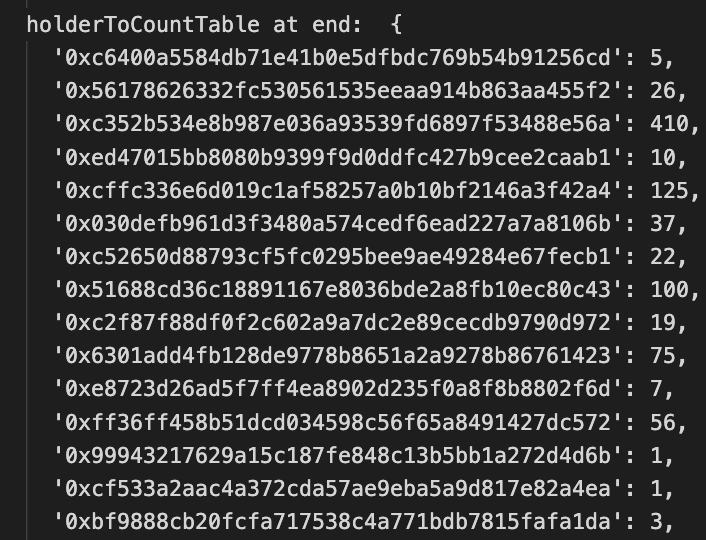
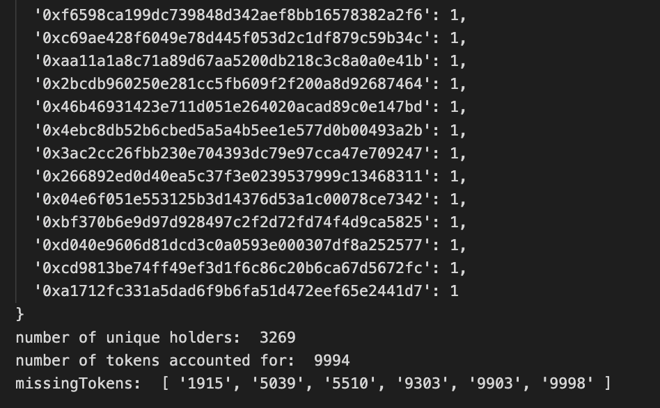
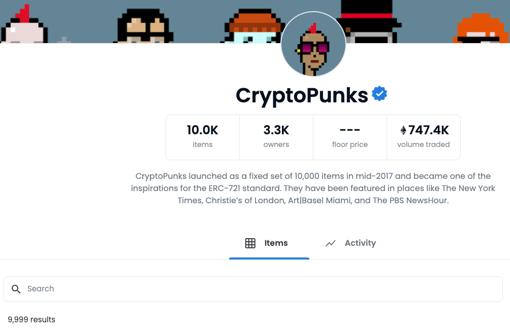

# Quick & Easy NFT Holders Snapshot

This is a script that allows you to take a quick Snapshot of all wallet addresses that hold an inputted NFT (ERC721) project using the Moralis API. 
  
The script returns a JS object (look up table) of a walletAddress to the number of NFTs they own of that project. Also logs some summary statistics of total number of unique holders, number of tokens it could retrieve, and what token numbers were missing from the Moralis API.

Moralis API Doc:
https://deep-index.moralis.io/api-docs/#/

### What The Output Looks Like

